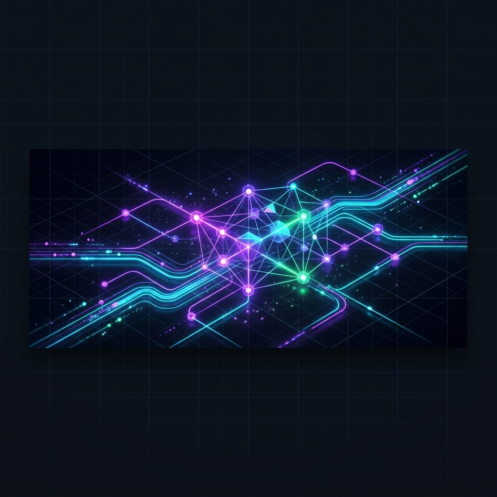

  

<h1 align="center">👋 ¡Hola, soy Victor Aranguren!</h1>

  <strong>Solana Frontend Developer | Solana Allstars Venezuela Contributor</strong>

  
  
  
  
  
  

---

### 🚀 Sobre Mí / About Me

Soy un desarrollador frontend apasionado por el ecosistema de **Solana**. Como colaborador activo de **Solana Allstars Venezuela**, me especializo en la creación de aplicaciones descentralizadas (dApps) intuitivas y en la generación de contenido educativo de alto impacto para impulsar y capacitar a la próxima generación de desarrolladores Web3 en Latinoamérica.

* 🛠️ **Frontend Specialist:** Construyo interfaces Web3 rápidas, modernas y accesibles utilizando React, Next.js y librerías del ecosistema de Solana.
* 🎓 **Educador Web3:** Me encanta compartir conocimiento, crear tutoriales y facilitar el onboarding de nuevos desarrolladores al ecosistema.
* 🦀 **Rust & Smart Contracts:** Aprendiendo y profundizando en el desarrollo de programas on-chain en Solana (Rust/Anchor) para crear arquitecturas completas e innovadoras.

---

### 💻 Stack Tecnológico / Tech Stack

| Categoría | Tecnologías |
| :--- | :--- |
| **Blockchain** |   |
| **Frontend** |     |
| **Herramientas & Backend** |    |

---

### 📊 Estadísticas de GitHub / GitHub Stats

  
  

  

---

  <i>"Let's build the future of decentralized tech on Solana together!"</i> 🚀

